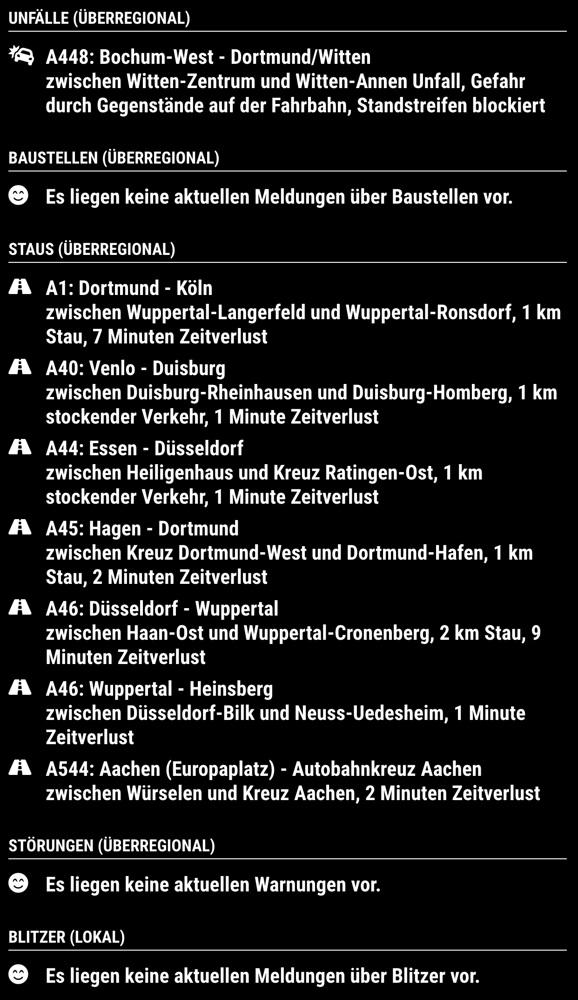

# MMM-AntenneUnnaTraffic
A module for the MagicMirror project which creates a table filled with traffic data from radio unna in germany.

Forked and customized from MMM-JsonTable Module.

## Installation
````
cd ~/MagicMirror/modules/
git clone https://github.com/eckonator/MMM-AntenneUnnaTraffic.git
cd ~/MagicMirror/modules/MMM-AntenneUnnaTraffic
npm install
````

After MagicMirror Update, maybe it can help to run:
````
cd ~/MagicMirror/modules/MMM-AntenneUnnaTraffic
./node_modules/.bin/MagicMirror-rebuild
````

## Config Options
| **Option** | **Default** | **Description** |
| --- | --- | --- |
| url | "" | The full url to get the json response from |
| arrayName | null | Define the name of the variable that holds the array to display or use one of this special keys to get the specific data from Antenne Unna:<br /><br /><strong>overregional.accident<br />overregional.construction<br />overregional.trafficjam<br />overregional.warning<br />local.radars</strong>|
| keepColumns | [] | Columns on json will be showed |
| tryFormatDate | false | For every column it checks if a valid DateTime is given, and then formats it to HH:mm:ss if it is today or YYYY-MM-DD otherwise |
| size | 0-3 | Text size at table, 0 is default, and 3 is H3 |
| updateInterval | 15000 | Milliseconds between the refersh |
| descriptiveRow | "" | Complete html table row that will be added above the array data |

## Example

Configuration:

```javascript

{
    module: 'MMM-AntenneUnnaTraffic',
    position: 'top_left',
    header: 'Unfälle (überregional)',
    config: {
        url: 'https://api-prod.nrwlokalradios.com/traffic/detail?station=42', // Required
        arrayName: 'overregional.accident'
    }
},
{
    module: 'MMM-AntenneUnnaTraffic',
    position: 'top_left',
    header: 'Baustellen (überregional)',
    config: {
        url: 'https://api-prod.nrwlokalradios.com/traffic/detail?station=42', // Required
        arrayName: 'overregional.construction'
    }
},
{
    module: 'MMM-AntenneUnnaTraffic',
    position: 'top_left',
    header: 'Staus (überregional)',
    config: {
        url: 'https://api-prod.nrwlokalradios.com/traffic/detail?station=42', // Required
        arrayName: 'overregional.trafficjam'
    }
},
{
    module: 'MMM-AntenneUnnaTraffic',
    position: 'top_left',
    header: 'Störungen (überregional)',
    config: {
        url: 'https://api-prod.nrwlokalradios.com/traffic/detail?station=42', // Required
        arrayName: 'overregional.warning'
    }
},
{
    module: 'MMM-AntenneUnnaTraffic',
    position: 'top_left',
    header: 'Blitzer (lokal)',
    config: {
        url: 'https://api-prod.nrwlokalradios.com/traffic/detail?station=42', // Required
        arrayName: 'local.radars'
    }
}

```

## Screenshot

